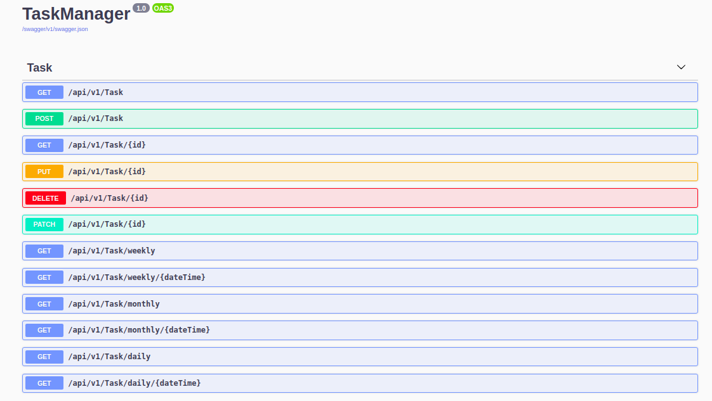

# TaskManager

## Tools

- AspNetCore
- MongoDB
- SwaggerUI for testing API

## Endpoints

- [x] Get all tasks as a List. (**GET**)
- [x] Get a task by ID. (**GET**)
- [x] Create a task. (**POST**)
- [x] Update a task. (**PUT**)
- [x] Delete a task. (**DELETE**)
- [x] Update a task. (**PATCH**)
- [x] Get this week's tasks. (**GET**)
- [x] Get tasks in the specific week. (**GET**)
- [x] Get this month's tasks. (**GET**)
- [x] Get tasks in the specific month. (**GET**)
- [x] Get today's tasks. (**GET**)
- [x] Get tasks in the specific day. (**GET**)

## Screenshot of SwaggerUI

